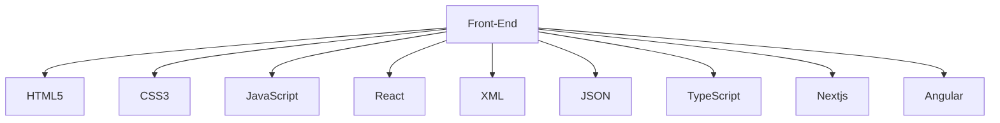
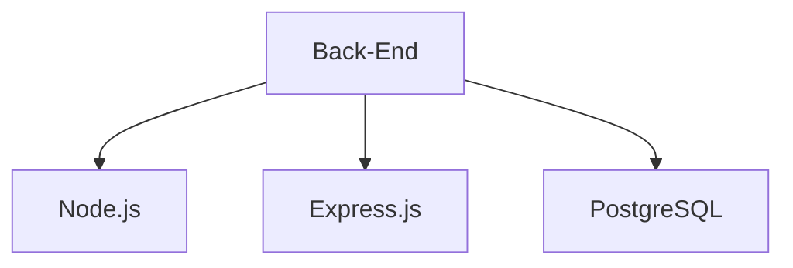

<!--
**jcortes009/jcortes009** is a ✨ _special_ ✨ repository because its `README.md` (this file) appears on your GitHub profile.
-->
 

# 💻 Tech Stack:

 # 🌐 Socials:
 

 # 💻 Tech Skills:
 

 

 
 
  

 
   
   
    
   
   
  
  
  
  
  
  
  
  
   
   
   
   
  
    

 

 
<b>Visitors Count 👽 </b>
  

 
 

<!---->

<!-- Proudly created with GPRM ( https://gprm.itsvg.in ) -->
